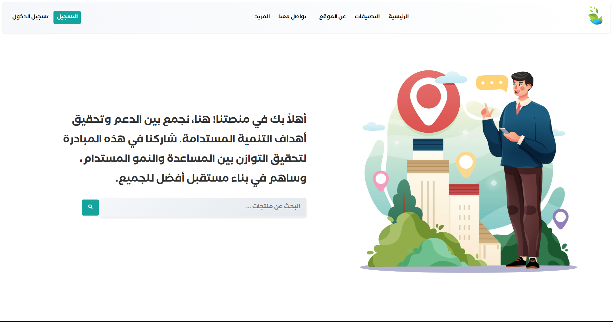

# Attaa - Achieving Sustainable Development Through Exchange

## Project Overview

"**Attaa**" is a project designed entirely in Arabic. The primary goal of this project is to achieve Sustainable Development Goals, including environmental preservation and poverty eradication. The platform displays items that people offer for exchange, completely free of charge.

The website features a main interface with a navigation bar ("navbar") that includes links to categories such as clothing, devices, and more. Additionally, it provides links to sections such as "About the Site," "Contact Us," and a "Leaderboard." Users can also register and log in.

The main screen includes a hero section with a brief explanation of the site and a search area for products. Below that, users can find the best categories, user stories, and a footer.

The categories page showcases products related to specific categories, and when users click on a product, they are taken to a page with detailed product information and donor information.

After successfully logging in, users can post products, but these posts await approval from the admin before being published. Users can also view their profiles, see their published and pending products, and edit their profiles.

Points are awarded to users each time they add a product. There is a leaderboard page that displays the top ten donors with the most points.

## Technologies Used

- **Front End:** HTML, CSS, JavaScript
- **Back End:** Laravel, MySQL

## Home Page

 